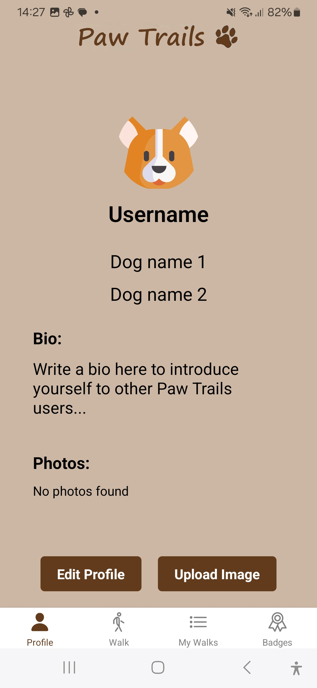
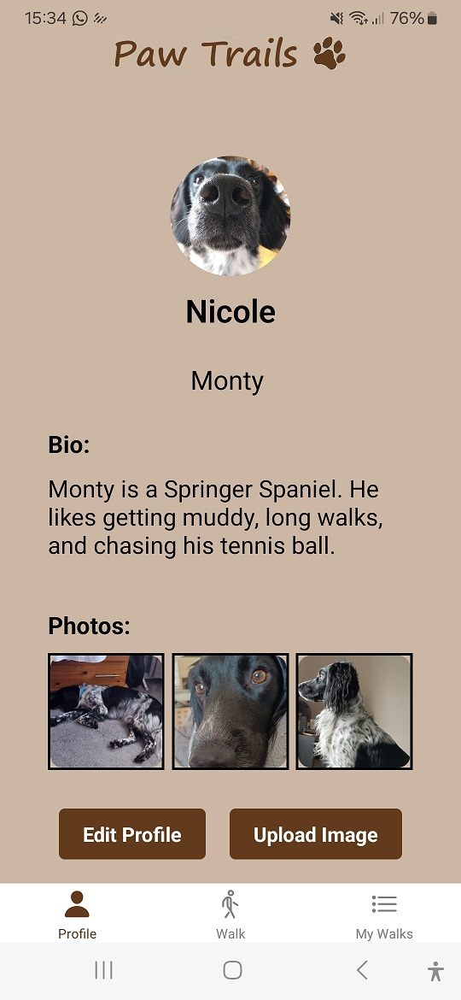
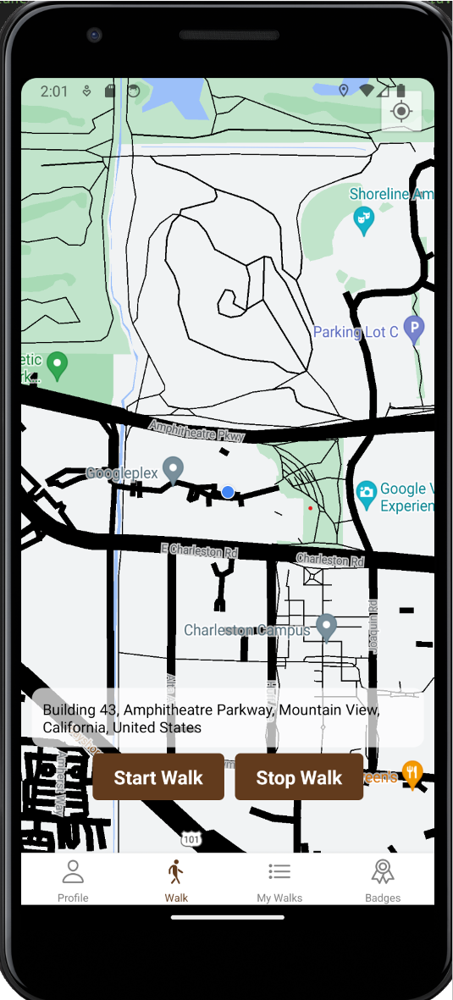
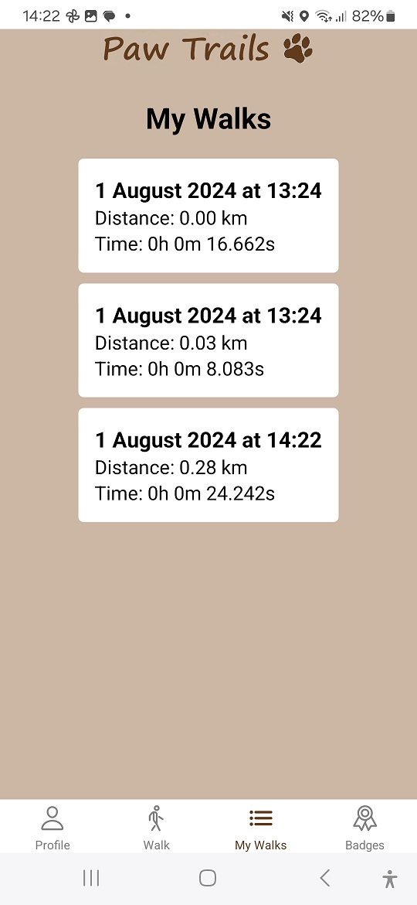
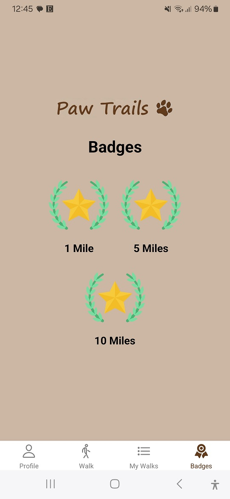

# Paw Trails

**Paw Trails** is a mobile app designed to encourage dog walking by tracking distances and awarding badges for achievements. Built with **React Native** and **Expo**, it offers a user-friendly experience with accessible design considerations.

## Features
- **Walk Tracking**: Track distances walked.
- **Badges**: Earn badges for reaching walking milestones.
- **Profile Management**: Customize profiles with pictures and dog names.

## Screenshots

### Profile Screen


### Edited Profile Screen


### Walk Tracking Screen


### Saved Walks


### Badges Screen


## Installation
1. Clone the repository:
   ```bash
   git clone https://github.com/NicoleBreen/PawTrails.git
   cd PawTrails
2. Install dependencies:
   ```bash
   npm install
3. Run the app:
   ```bash
   expo start

## Reflection
This project highlights key concepts from my degree, including:
- **Mobile App Development** using React Native.
- **User-Centered Design** with accessibility considerations.
- **Software Engineering Best Practices**, focusing on modular code and testing.
Future improvements include complete integration between badge tracking and walk distance data, visualizing walk distance data through interactive graphs for a more engaging and user-friendly design, enhanced navigation, and more comprehensive testing.

## Acknowledgments
Special thanks to the resources from the React Native and Jest communities for testing guidance.
